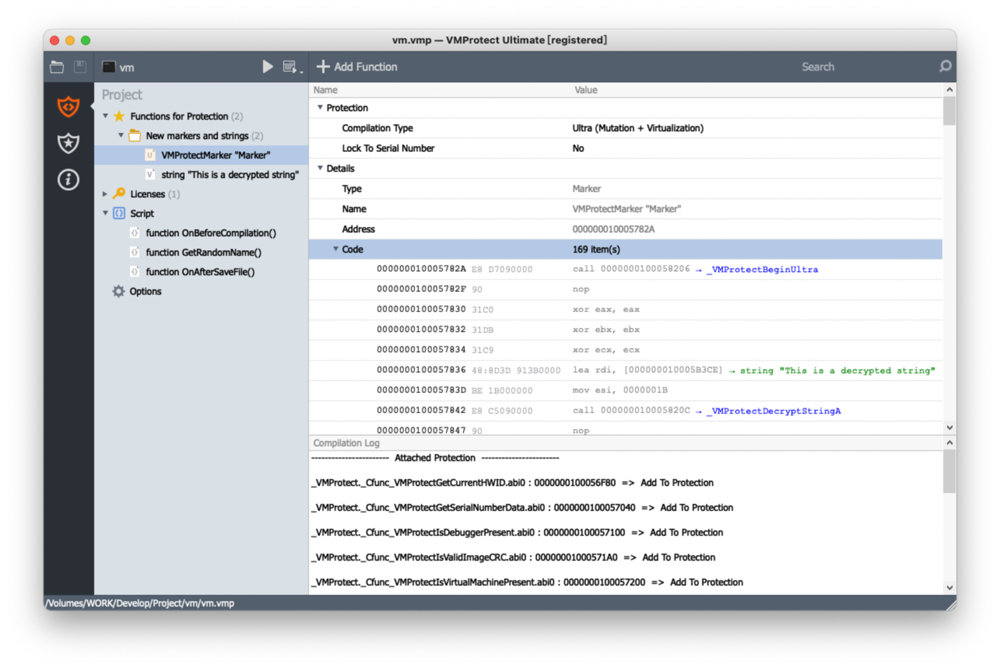

# VMProtectSDK-Golang
``UnOfficial VMProtectSDK for Golang``

```
    Due to the particularity of Golang, VMP is not compatible with it. 

For example, there is no 0 at the end of the Golang string, 

and ABI is non-standard(GO x64 ABI: RAX, RBX, RCX, RDI, RSI, R8, R9, R10, R11)

If use CGO, VMP does not recognize Marker and the string need to encrypt,

if not use marker to protect a full function, sometimes it may crash.

After a while of research, I solved the compatibility of some VMProtect with Golang.

Now VMProtect can recognize the address of VMProtectBegin and VMProtectEnd.

MarkerName and the string need to encrypt all can be detected(work well on mac and win).

Because of I didn't have Web License Manager, so the correlation function has not been implemented.

Most functions are Bind.
```

### Simple function calls
```Golang
package main

import (
	"VMProtect"
	"time"
)

func main() {
	VMProtect.BeginUltra("Marker\x00")
	str := VMProtect.GoString(VMProtect.DecryptStringA("This is a decrypted string\x00"))
	serial := "SerialNumber\x00"

	println(str)
	println("HWID: ", VMProtect.GetCurrentHWID())
	println("IsProtected: ", VMProtect.IsProtected())
	println("IsDebuggerPresent: ", VMProtect.IsDebuggerPresent(true))
	println("IsVirtualMachinePresent: ", VMProtect.IsVirtualMachinePresent())
	println("IsValidImageCRC: ", VMProtect.IsValidImageCRC())
	println("SetSerialNumber: ", VMProtect.SetSerialNumber(serial))
	if VMProtect.GetSerialNumberState() == VMProtect.SERIAL_STATE_SUCCESS {
		println("-- Registered --")
	}
	println("User: ", VMProtect.GetUser())
	println("Email: ", VMProtect.GetEmail())
	println("ExpireDate: ", VMProtect.GetExpireDate())
	println("MaxBuildDate: ", VMProtect.GetMaxBuild())
	println("RunningTimeLimit: ", VMProtect.GetRunningTimeLimit())
	time.Sleep(3 * time.Minute)
	if VMProtect.GetSerialNumberState() == VMProtect.SERIAL_STATE_FLAG_RUNNING_TIME_OVER {
		println("-- Running Time Over, Please Registere --")
	}
	VMProtect.End()
}
```
<p align="center">
  
</p>


### Test platform

```
· window 11 ｜ Mac OS 12.4    (Linux not tested,According to the feedback, it is okay)

· Go 1.17 1.18.2
  
· VMProtect Ultimate v3.4 v3.6
```

### Protection effect
```
    After disassembly viewing the protected program,with memory protection and pack turned off, 

the marked code are successfully protected by VMProtect, and the encrypted string cannot be searched, 
  
proving that VMProtect and Golang are compatible and the protection is effective.
```

### Guide
```
Copy "VMProtect" and "example" folder to "/Users/YourName/go/src/"

Please install the c compiler if not.
 
· Mac: xcode-select --install
· Mac Cross build PE: sudo port install x86_64-w64-mingw32-gcc or download llvm-mingw
· Windows: download llvm-mingw
  
Modify the build script,set the CC
  
run the script to build

```

### Tip
```
1.\x00 or \000 must be added after string ,like VMProtect.BeginUltra("Marker\x00").

2.Don't use the -gcflags "-N -l" command to compile , Otherwise VMP cannot recognize the Marker.

3.Must use -ldflags "-s -w" to strip the Symbol，Otherwise VMP cannot recognize the file.

4.Refer to the files in the example folder and modify the GoPath.

5.If necessary, add scripts in script.lua for additional protection.

6.Linux has not been tested. Maybe, but some of the code needs to be modified.

7.You must use VMProtect.GoString to convert func DecryptString's char to string,not C.GoString.

8.32-bit systems are not supported.
  
9.If you import other projects from github, please set GO111MODULE=on and modify go.mod,
  replace VMProtect => /Users/YourName/go/src/VMProtect.
  
10.Don't use obfuscate tool to build before protect(like garble),VMP cannot recognize.

11.'VMProtectLicense.ini' just for test sdk before protect,after protected,it's useless and can be deleted.
```

